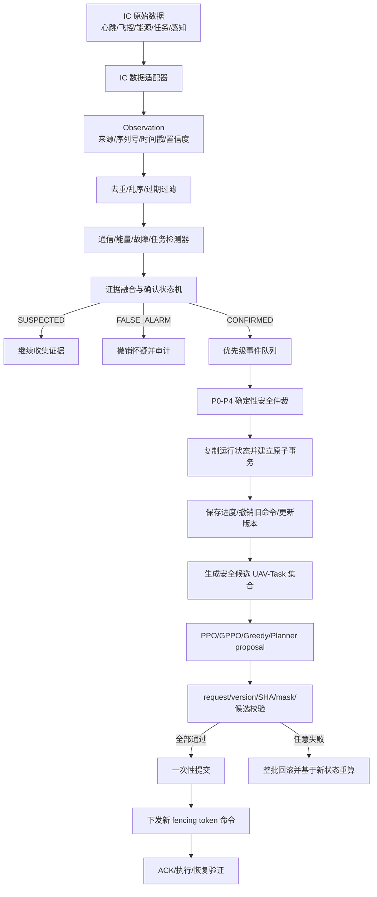
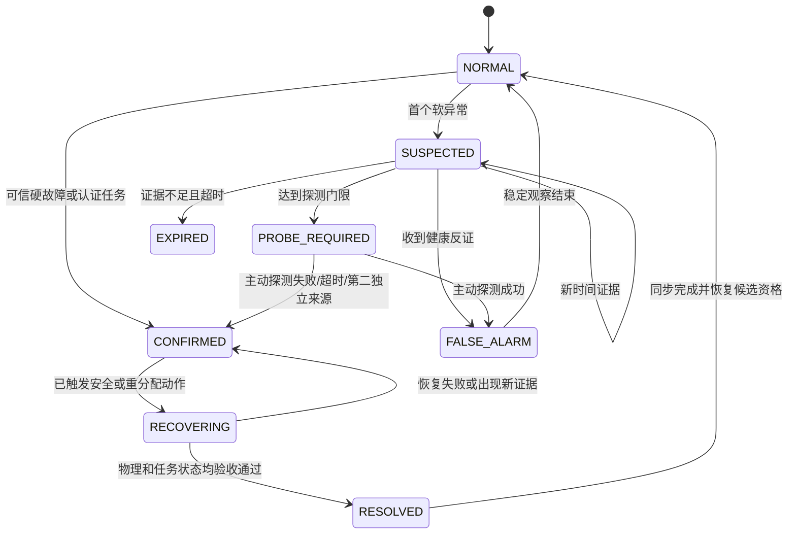
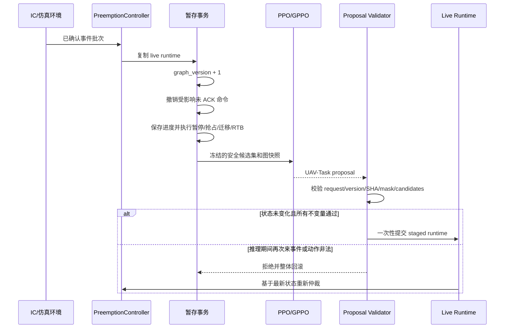

# 执行中动态扰动、证据确认与 GPPO 任务重分配工程说明

> 文档用途：汇总当前 `research/execution-preemption-v1` 分支的研究动机、工程设计、实现边界、验证证据与后续计划，供阶段汇报、IC 接口讨论和正式实验设计使用。
>
> 基线：`main@a4207527f713e6f15dcdbc538134aeaca28a03ac`（只读）。
>
> 研究分支：`research/execution-preemption-v1`。
>
> 状态说明：当前已完成机制、接口和开发回放验证；尚未完成 IC 真实数据接入、正式训练、Hidden-V1 和模型效果结论。

## 1. 一句话结论

本工作不是简单增加几种随机扰动，而是在论文“事件已经被系统知道，然后触发任务重分配”的框架上，补充从异步观测到确认事件、从执行中断到安全重分配、再到旧决策失效和原子提交的工程闭环：

```text
IC 原始数据
→ Observation 观测证据
→ ConfirmedEvent 任务级确认事件
→ P0-P4 确定性安全仲裁
→ PPO/GPPO 从安全候选集中选择 UAV-Task
→ 版本校验与原子提交
→ ACK、执行与恢复验证
```

安全层决定是否继续、排队、暂停、抢占、迁移、终止或返航；PPO/GPPO 只决定在已经过滤的安全候选中由哪架 UAV 执行哪个任务，不能绕过能量、通信、任务兼容性、唯一所有权和版本约束。

## 2. 与原论文的关系

参考论文：J. Yu, Y. Zhang, and C. Sun, *Multi-UAV Dynamic Task Assignment Based on Event-Triggered Graph Reinforcement Learning Under Weak Communication*, IEEE TASE, 2025, [DOI: 10.1109/TASE.2025.3593125](https://doi.org/10.1109/TASE.2025.3593125)。

### 2.1 论文明确提供的基础

- 将动态任务分配视为事件触发的任务重分配过程；
- 在特定事件发生时通信和更新任务，降低弱通信条件下的通信占用；
- 使用固定间隔的多节点 heartbeat 识别不工作的 UAV；
- leader 失效后由后续 UAV 接任；
- 正常通信时进行全局重分配，受限通信时使用局部信息和多节点验证；
- 通过 UAV-Subtask 异构图、任务依赖、动态图和动态动作 mask 生成任务分配；
- 使用图神经网络、注意力机制和 PPO 形成 GPPO。

### 2.2 论文没有展开的工程问题

- 原始心跳、飞控、能源和任务数据如何转换为任务级事件；
- 单次丢包、短时通信退化和 UAV 损毁如何区分；
- 证据来源、时间戳、置信度、重复、乱序、假阳性和假阴性如何处理；
- 任务执行到一半时如何保存进度并进行抢占、迁移或返航；
- GPPO 推理期间再次到达事件时如何作废旧动作；
- 旧命令、迟到 ACK、任务租约和重复执行者如何处理；
- 如何在真实 IC 接口中完成上述闭环。

论文实验主要在固定时间步切换任务分布来触发重分配，因此验证重点是“环境变化后能否重新生成较好的任务分配”，不是“能否从真实异步遥测中准确检测和确认事件”。

### 2.3 当前工作的定位

当前工作应表述为：

> 以论文的事件触发 GPPO 动态任务分配为方法基础，面向真实 IC 执行环境，对事件采集与证据确认、执行中抢占、弱通信时效和并发一致性进行工程化补全。

在未完成更完整的相关工作检索、正式训练和独立评估前，不把上述工程补全直接表述为已经证明的学术创新或性能优势。

## 3. 总体架构



## 4. 当前扰动集合

### 4.1 四类核心扰动

| 扰动类别 | 典型输入 | 确认后的处理 |
|---|---|---|
| 新任务扰动 | 紧急短时任务、高价值目标、普通或低收益临时任务 | 使用空闲 UAV；必要时抢占低优先级可抢占任务，否则排队 |
| UAV 状态扰动 | UAV 损毁、执行失败、无法继续执行 | 隔离 UAV，保存进度，迁移、失败或终止任务 |
| 能源扰动 | 能量裕量不足、无法安全返航 | 停止接收新任务，保存进度，迁移任务并 RTB；无法返航时执行 P0 安全动作 |
| 通信扰动 | 延迟、丢包、失联、恢复、旧报告晚到 | 计算信息年龄，暂停或迁移；拒绝过期命令和低 token 的迟到 ACK |

### 4.2 开发场景

`Dynamic-Preemption-Dev` 冻结为 10 类、每类 20 条，共 200 条开发 tapes：

1. 搜索执行 40% 时出现 P1 紧急任务；
2. 搜索执行 90% 时出现低收益临时任务；
3. 不可抢占打击任务期间出现普通任务；
4. 执行 UAV 中途损毁并迁移任务；
5. 执行 UAV 低能量并安全返航；
6. 通信延迟导致旧任务取消报告晚到；
7. 同一任务连续发生优先级变化；
8. 两个 P1 事件原子同时到达；
9. 重分配推理窗口内再次到达安全事件；
10. 通信恢复窗口内再次到达紧急事件。

该开发集用于机制调试和接口验证，不能替代算法冻结后的独立 Hidden-V1。

## 5. 事件采集与证据确认

### 5.1 True、Observation 与 Confirmed 必须分离

```text
TruthEvent      = 物理世界或仿真器中的真实变化
Observation     = 某个数据源在某时刻报告的证据
ConfirmedEvent  = 系统融合证据后接受的任务级事件
```

真实运行不能让调度器直接读取 `TruthEvent`，否则会产生不现实的“上帝视角”。IC 接入应从原始遥测和任务接口生成 `Observation`。

每条观测至少保留：

- `observation_id`、`event_id`；
- `source_id`、`source_type`、`signal_type`；
- `sequence`；
- `confidence`、`positive`；
- `emitted_at`、`received_at`、可获得时的 `occurred_at`；
- 受影响 UAV、Task、Region 或 Target；
- `state_version` 和原始 payload。

### 5.2 通用确认状态机



证据按独立 `source_id` 统计，而不是按消息数量统计。同一来源连续发送三条相同消息可以用于时间连续性判断，但不能伪装为三个独立来源。健康遥测属于反证，可在事件确认前撤销怀疑。

### 5.3 四类检测器的最小规则

| 检测器 | 软证据 | 确认条件 | 反证/恢复 |
|---|---|---|---|
| 通信 | 单次心跳缺失、延迟持续上升 | 连续缺失达到门限后 probe 超时，或第二独立来源确认 | 新序列号健康遥测、时延恢复并完成版本同步 |
| 能源 | 安全裕量接近警戒线 | 连续采样低于安全线；无法返航属于 P0 | 裕量超过更高恢复线并稳定若干采样 |
| UAV 故障 | 姿态、导航、电流等软异常 | 可信硬故障直接确认；软异常采用 N-of-M、两源一致或 probe 失败 | 自检通过、健康遥测和稳定观察 |
| 短时任务 | 传感器派生任务或上级指令 | 认证指挥任务直接确认；感知派生任务需时间/多源确认 | 上级取消、任务过期或目标被反证 |

能源判定建议使用安全裕量而不是单一电量百分比：

```text
energy_margin
= 当前可用能量
- 安全储备能量
- 预计返航能量
- 当前任务剩余能量需求
```

具体心跳周期、缺失次数、probe timeout、能源门限和恢复门限必须配置化，并由 IC 日志、HIL 或真实试验标定；当前仿真默认值不能直接称为真实系统参数。

### 5.4 当前检测层的实现边界

当前已经具备 Observation、弱通信模拟、重复/迟到过滤、确认状态机、事件队列和适配器骨架，但真实 IC 心跳订阅、飞控故障码、电池遥测、任务接口、实际 probe 发送和多传感器关联尚未落地。

此外，前端 `event_runtime` 的旧事件类型与 `execution_preemption` 的八类运行事件尚未完全统一，需要由 IC bridge 完成标准化映射。

## 6. 执行中再次发生扰动的处理

### 6.1 事件等级

| 等级 | 典型事件 | 默认动作 |
|---|---|---|
| P0 | UAV 损毁、碰撞风险、能源无法返航 | 安全动作立即中断任务；模型不能否决 |
| P1 | 紧急短时任务、高价值目标 | 可抢占低优先级、可抢占任务 |
| P2 | 低能量、持续失联 | RTB、暂停或迁移 |
| P3 | 普通任务、优先级或 deadline 变化 | 空闲分配或排队 |
| P4 | 低价值状态更新 | 当前任务继续 |

同等级按 deadline、任务优先级、信息年龄、接收时间和 `event_id` 确定性排序。

### 6.2 突发瞬间的事务流程



必须始终满足：

- 一个排他任务最多一个 active UAV；
- 一架 UAV 最多一个 active task；
- Task 到 UAV 与 UAV 到 Task 引用双向一致；
- 终态任务不占用 UAV；
- 过期 graph version、状态 SHA 或 fencing token 的动作和 ACK 必须拒绝；
- 同一任务进度只能由 live executor 累计一次；
- 任意失败使整批事务回滚，提交前不修改 live runtime。

### 6.3 推理期间再次来事件

模型基于版本 `V` 推理时，如果 live state 因新事件或进度 tick 发生变化，旧动作会因 `graph_version` 或 `graph_sha256` 不匹配而被拒绝。系统不会让旧决策覆盖新状态，而是基于最新快照重新仲裁和推理。

## 7. PPO 与 GPPO 的区别

两者共享同一环境、reward、动作表、安全 mask、proposal validator 和原子事务。当前主要差别是状态表示和策略网络，不是安全权限。

| 对比项 | PPO-MLP | GPPO-Adaptive |
|---|---|---|
| 输入 | 固定长度平坦向量 | 五类节点、七类关系的变长异构图 |
| 当前输入规模 | 37,976 维 | 节点和边随实际场景变化 |
| 主体网络 | MLP | 类型编码器 + 两层关系消息传递 + 门控 |
| 关系表达 | 稠密关系矩阵中的固定位置 | 显式 typed edge |
| 动作评分 | 一次输出全部动作 logits | 对合法 UAV-Task 候选边评分 |
| 优势 | 简单、较容易训练和部署 | 更适合表达动态关系和规模变化 |
| 代价 | 高维、稀疏、补零较多 | 图构建和消息传递更复杂 |

当前不能声称 GPPO 已经优于 PPO。两类策略只完成统一框架和 tiny smoke，正式训练、随机种子比较和 Hidden-V1 尚未开始。

## 8. 五类节点与维度

### 8.1 节点语义

| 节点 | 特征维度 | 实际作用 | 当前判断 |
|---|---:|---|---|
| UAV | 15 | 能量、通信、可用性和当前进度，决定资源是否安全可用 | 核心，直接影响分配 |
| Task | 17 | 优先级、deadline、进度、可抢占性和状态，决定任务需求与中断代价 | 核心，直接影响分配 |
| Region | 5 | 区域空缺、需求、优先级和不确定性 | 搜索覆盖场景有价值，当前 actor 影响有限 |
| Target | 6 | 目标发现、跟踪、摧毁状态、置信度和优先级 | 目标任务链有价值，当前缺少连接边 |
| Event | 12 | 事件类型、优先级、严重度、信息年龄和置信度 | 动态重分配核心，直接影响 UAV/Task |

五类节点不是“五维图”。GPPO 输入为：

```text
UAV:    N_UAV    x 15
Task:   N_Task   x 17
Region: N_Region x 5
Target: N_Target x 6
Event:  N_Event  x 12
七类变长 edge_index
16 维规则上下文
```

节点经过类型编码器统一映射为 64 维隐藏表示。最大容量为 32 UAV、96 Task、96 Region、32 Target 和 8 Event，总节点上限 264；实际 GPPO 只处理当前存在的节点和边。

### 8.2 PPO 的 37,976 维来源

```text
节点特征：
32x15 + 96x17 + 96x5 + 32x6 + 8x12 = 2,880

节点存在 mask：
32 + 96 + 96 + 32 + 8 = 264

七类稠密关系矩阵：
32x96 + 32x96 + 96x96 + 96x96 + 8x32 + 8x96 + 96x96
= 34,816

规则上下文：16

总计：2,880 + 264 + 34,816 + 16 = 37,976
```

关系矩阵约占平坦输入的 91.7%，这是 PPO 输入高维和稀疏的主要原因，也是 GPPO 使用稀疏图关系的结构动机之一。

### 8.3 动作空间

```text
NOOP + 32 UAV x 96 Task = 3,073
```

PPO 和 GPPO 共用该动作表。不存在的节点、能力不匹配、失联、低能量、资源占用以及不属于当前 AllocationRequest 的组合全部被安全 mask 排除。

### 8.4 当前图结构的真实缺口

目前 `Event -> UAV/Task` 能直接影响 GPPO 的 UAV-Task 边评分，UAV、Task 和 Event 已构成有效核心图。但还存在两点：

1. `Task -> located_in -> Region` 是单向关系，Region 的需求和空缺不能通过当前消息方向反向传回 Task；
2. Target 当前没有与 Task、Event 或 UAV 的关系边，主要只能参与全局池化，不能充分影响具体 UAV-Task 动作分数。

如果 IC 场景确实包含区域覆盖和目标跟踪，应考虑增加稀疏反向关系：

```text
Region -> has_task -> Task
Task   -> acts_on  -> Target
Target -> requires -> Task
Event  -> affects  -> Target
```

如果真实任务不提供 Region 或 Target 数据，应将其标为可选节点，而不是为了节点数量保留孤立结构。推荐采用“UAV + Task + Event 三类核心节点，Region 和 Target 按场景启用”的策略，并通过三节点、四节点、五节点消融实验验证收益与时延。

## 9. 当前验证证据

| 项目 | 当前证据 | 能说明什么 | 不能说明什么 |
|---|---|---|---|
| Execution-Preemption 专项测试 | 120/120 PASS | 协议、接口和不变量测试通过 | 不能证明模型效果 |
| 规则开发事件带 | 200/200 PASS | 10 类执行中场景可确定性回放 | 不能替代 held-out |
| 非学习基线安全回放 | 3 种方法、600 次 | 接口、安全 shell 和基线语义已冻结 | 不能证明谁更优 |
| 直接/延迟事务 parity | 400/400 PASS | 原子延迟提交与直接回放一致 | 不评价算法质量 |
| PPO/GPPO adapter smoke | 4/8/16/32 PASS | 统一观察、动作、mask 和校验链路可运行 | 不是实时性或泛化结论 |
| tiny training smoke | 四种学习方法 2-step PASS | 训练器和 evidence seal 能运行 | 不是正式训练 |

当前明确状态：

```text
training_allowed = false
model_effectiveness_evaluated = false
formal 50k training = not started
Hidden-V1 = not generated
IC integration = not verified
```

## 10. IC 接入需要确认的最小接口

应向 IC 负责人确认：

### UAV 与通信

- UAV ID、消息序列号、采样/发送/接收时间；
- 心跳周期、最后正常时间、链路状态；
- 飞控故障码、执行状态、当前任务 ID；
- 是否支持主动 probe 和通信恢复通知。

### 能源

- 当前能量或电量、电压、电流、实时功耗；
- 安全储备、预计返航能量或计算所需位置/航程字段；
- 数据更新频率和测量误差；
- IC 是否已有低能量和不可返航判定。

### 任务

- 新任务、取消、优先级、deadline 变化接口；
- 任务是否允许执行中断、暂停和恢复；
- 当前进度和剩余工作量；
- 新分配结果如何下发，以及是否返回 ACCEPTED/EXECUTING/REJECTED ACK。

### 区域与目标

- 是否存在稳定的 Region ID、覆盖需求和空缺状态；
- 是否存在 Target ID、发现/跟踪/摧毁状态和置信度；
- Region/Target 与 Task 的关联由 IC 提供还是由本模块维护。

在这些接口获得确认前，只能表述为“仿真层机制已实现，IC 落地条件待确认”。

## 11. 正式实验与验收计划

### 11.1 方法

- 师姐真实旧方法；
- Greedy Priority；
- Beam-MPC；
- PPO-MLP Reactive / Rule-Arbiter；
- GPPO-Adaptive Reactive / Rule-Arbiter。

### 11.2 规模

- 4、8、16 UAV 正式训练和同合同比较；
- 32 UAV 使用冻结模型进行零样本扩展与尾部时延检查；
- 任务数量按 UAV:Task 约 1:2 或 1:3 同步放大。

### 11.3 指标

- 紧急任务 deadline miss；
- 抢占响应时延；
- 累计任务空缺；
- 原任务恢复率；
- 平均进度损失；
- 能源安全违规、资源冲突和重复执行者；
- 任务饥饿、距离与负载；
- 构图、推理、校验和端到端决策时延的 mean/P50/P95/P99。

### 11.4 最低验收标准

```text
资源冲突 = 0
旧命令复活 = 0
能源安全违规 = 0
P0 事件处理率 = 100%
紧急任务 deadline miss 相对旧方法降低 >= 10%
累计空缺相对旧方法降低 >= 10%
普通任务恢复率 >= 95%
```

正式效果结论必须使用师姐真实旧方法实现、同一合同、同一 seeds 和独立 Hidden-V1。当前 `senior_legacy_method_v1` 只是旧行为适配，不等同于师姐真实实现。

## 12. 节点与特征消融

为证明五类节点和当前维度不是任意堆叠，应至少进行：

| 消融 | 验证问题 |
|---|---|
| UAV + Task | 论文式基础图的最低能力 |
| UAV + Task + Event | 显式事件节点是否改善动态响应 |
| 再加入 Region | 区域空缺、覆盖和恢复指标是否改善 |
| 再加入 Target | 目标任务链和泛化是否改善 |
| 去掉 `remaining_work` | 与 `progress` 的冗余是否必要 |
| 去掉 `energy_margin` | 派生安全特征是否帮助训练 |
| 图层 1/2/3 | 消息范围与时延的权衡 |
| hidden 32/64/128 | 表达能力、显存和响应时延的权衡 |

保留某节点或特征至少应满足：IC 可观测、会随状态变化、能够影响决策、不能被更简单特征稳定替代，并在消融中带来效果、鲁棒性或可解释性收益。

## 13. 阶段汇报建议表述

> 本阶段以论文的事件触发 GPPO 动态任务分配框架为基础，在个人研究分支中独立重写执行中动态任务分配模块，没有修改 main 原任务分配核心。原论文主要关注事件发生后的任务重分配，并默认系统已经识别事件；当前工作补充了从异步遥测观测、证据确认、事件优先级仲裁，到任务进度保存、抢占迁移、版本校验和原子提交的工程闭环。
>
> 当前扰动覆盖通信延迟与失联、UAV 失效、能量不足和短时任务，并展开为 10 类执行中开发场景。安全层由确定性规则决定继续、抢占、迁移、终止或返航，PPO/GPPO 只从安全候选集合中选择 UAV-Task 配对。执行过程中再次来事件时，旧模型动作会因 graph version 或状态哈希变化被拒绝，系统基于最新状态重新仲裁。
>
> 当前已完成协议、运行时、原子事务、五类节点图、PPO/GPPO 统一适配和开发回放验证；尚未完成 IC 真实数据接入、师姐真实旧方法接入、正式训练和 Hidden-V1，因此现阶段不声称 GPPO 已经优于 PPO 或旧方法。下一步是确认 IC 可提供的数据和中断接口，完成事件适配与阈值标定，再进行同合同正式比较和 P95/P99 时延评估。

## 14. 下一步优先级

1. 将 IC 扰动接入方案发群，确认心跳、能源、故障、任务中断和 ACK 接口能否落地；
2. 统一 `event_runtime` 与 `execution_preemption` 事件类型和字段；
3. 实现真实 IC adapter，禁止真实运行直接读取 `TruthEvent`；
4. 根据实际任务决定 Region/Target 是否启用，并补齐必要反向关系；
5. 完成 source-bound Gate 和 clean training worktree；
6. 获得师姐旧方法的准确实现与实验合同；
7. 正式训练 PPO/GPPO，统计效果与 P50/P95/P99 时延；
8. 冻结模型和阈值后生成独立 Hidden-V1，一次性评估并封存证据。

## 15. 仓库内相关文档

- [`EXECUTION_PREEMPTION_V1_PROTOCOL_ZH.md`](EXECUTION_PREEMPTION_V1_PROTOCOL_ZH.md)
- [`EXECUTION_PREEMPTION_CONCLUSION_ZH.md`](EXECUTION_PREEMPTION_CONCLUSION_ZH.md)
- [`ALLOCATION_BOUNDARY_V1_ZH.md`](ALLOCATION_BOUNDARY_V1_ZH.md)
- [`POLICY_ADAPTER_V1_ZH.md`](POLICY_ADAPTER_V1_ZH.md)
- [`EXECUTION_BASELINES_V1_ZH.md`](EXECUTION_BASELINES_V1_ZH.md)
- [`EXECUTION_TRAINING_CONTRACT_V1_ZH.md`](EXECUTION_TRAINING_CONTRACT_V1_ZH.md)
- [`EXECUTION_LAUNCH_GATE_V1_ZH.md`](EXECUTION_LAUNCH_GATE_V1_ZH.md)
- [`../configs/execution_preemption_v1.json`](../configs/execution_preemption_v1.json)
- [`../configs/execution_graph_v1.json`](../configs/execution_graph_v1.json)
- [`../configs/execution_policy_adapter_v1.json`](../configs/execution_policy_adapter_v1.json)
