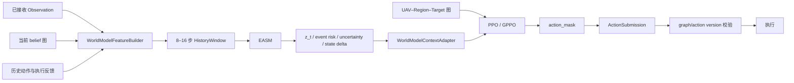

# 世界模型与 GPPO 输入整合实施规划

> 状态：规划稿 v1.0
>
> 日期：2026-08-31
>
> 目标：在不破坏现有事件确认、动作掩码与版本并发安全的前提下，为 PPO/GPPO 增加可复现、可消融、可回退的时序世界模型输入。

## 1. 决策摘要

本阶段不把 `Event` 直接增加为第四类图节点，也不复刻完整的像素生成式世界模型。推荐先实现一个轻量的**结构化事件感知状态模型**（下文简称 EASM）：

1. EASM 读取最近 `8–16` 个决策时刻内，策略当时真实可见的图状态、已接收事件观察、历史动作和执行反馈；
2. EASM 输出潜在状态 `z_t`、未来事件风险、预测不确定性和下一状态增量；
3. 输出被压缩为固定维度 `policy_context`，以残差方式注入 PPO/GPPO 的 Actor 和 Critic；
4. 现有 `ConfirmationStateMachine`、`action_mask`、`graph_version` 和 `action_version` 继续作为唯一安全边界；
5. 先离线训练和影子运行，再冻结 EASM 接入策略，最后才评估是否联合微调。

核心原则是：**世界模型提供风险，确认状态机提供事实，动作掩码与版本校验提供执行安全。**

## 2. 当前代码基线

当前发布版的策略输入图包含三类节点：

- `uav`
- `region`
- `target`

当前动作是一个 `UAV–Region` 候选边，外加最终的 `NOOP`。关键代码位置：

| 能力 | 当前代码 |
|---|---|
| 图状态与候选动作 | `ppo_allocation/random_event/graph.py` |
| GPPO / PPO Actor-Critic | `ppo_allocation/random_event/models.py` |
| PPO rollout 与 stale 重试 | `ppo_allocation/random_event/trainer.py` |
| 决策快照与版本化提交 | `ppo_allocation/random_event/environment.py` |
| truth → observation → confirmation → belief | `ppo_allocation/random_event/runtime_bridge.py` |
| 原始观察字段 | `event_runtime/observation.py` |
| 确认状态与 belief | `event_runtime/adapter.py`、`event_runtime/state_machine.py` |

本规划以公开三节点实现为基线。会议中提到的 `UAV / Task / Region / Target / Event` 五节点版本若后续提供，应单独做 schema diff 和兼容评估，不应阻塞本次最小闭环。

## 3. 目标与非目标

### 3.1 本阶段目标

- 补足前馈 PPO/GPPO 在乱序、延迟、短时盲区和连续扰动下缺少记忆的问题；
- 建立从可见历史到固定维度上下文的稳定输入合同；
- 确保 PPO 与 GPPO 获得完全相同的世界模型信息，维持公平比较；
- 支持逐项关闭 `history / event head / GES / policy context`；
- 建立无未来信息泄漏、stale 幂等和零上下文等价测试；
- 将世界模型额外 P95 推理开销控制在暂定 `2 ms` 内。

### 3.2 本阶段非目标

- 不允许预测事件直接修改 `belief`、`pending_regions` 或 `action_mask`；
- 不增加 `Event` 图节点；
- 不改变现有动作空间、奖励函数或合法性规则；
- 不在第一版做大型生成式世界模型；
- 不在数据接口尚未通过防泄漏审计时联合训练策略；
- 不用现有极端场景库的开发结果代替新的隐藏集验证。

## 4. 总体数据流



任何时刻的线上特征都必须满足：

```text
feature.received_at <= decision_time
feature.graph_version <= decision.graph_version
```

## 5. 世界模型输入合同

每个决策时刻生成一个 `WorldModelToken`，历史窗口由最近 `8–16` 个 token 组成。首版使用变长序列加 `padding_mask`，避免因 episode 开头历史不足而伪造数据。

### 5.1 图快照特征

图特征只从当前 `HeteroGraphState` 和当前 belief 构造。

#### UAV 集合

- `alive`
- `sensor_available`
- `task_type`
- 归一化位置 `(x, y)`
- 当前区域负载
- 当前跟踪目标
- 当前通信质量统计
- 后续补充：归一化电量、返航状态、预计剩余航时

#### Region 集合

- 归一化中心位置
- 优先级
- 工作量
- 空缺持续时间
- 当前分配 UAV
- `pending` 标志
- 当前分配是否合法
- 候选 UAV 数量

#### Target 集合

- 目标类型
- `discovered / tracked / destroyed`
- 可见时的归一化位置
- 所属 Region
- 当前 tracker

#### 边与动作空间摘要

- UAV–Region 能力、距离、是否当前分配、负载和通信质量；
- 合法候选动作数；
- `NOOP` 是否可用；
- `pending_region_count`；
- 当前合法动作比例。

### 5.2 图集合编码

不要让世界模型依赖当前固定节点数量。推荐分别对三类节点做共享 MLP，再做集合池化：

```text
UAV encoder    → mean + max ┐
Region encoder → mean + max ├→ graph_summary
Target encoder → mean + max ┘
```

首版 `graph_summary` 建议控制在 `64–96` 维。这样后续改变 UAV、Region 或 Target 数量时不需要重定义输入长度。

### 5.3 已接收事件证据

世界模型可以使用“已经收到但尚未确认”的观察，因为这些观察是策略在决策时真实可见的信息；但它们仍不能改变 belief。

对每一种事件，在最近时间窗内聚合：

| 特征 | 定义 |
|---|---|
| `positive_count` | 正证据数量 |
| `negative_count` | 负证据数量 |
| `distinct_source_count` | 独立来源数量 |
| `confidence_mean/max` | 平均/最大置信度 |
| `latest_age` | 最新报文距当前决策时间 |
| `delay_mean/max` | 已知报文的接收延迟 |
| `duplicate_ratio` | 重复报文比例 |
| `conflict_flag` | 是否存在正负冲突证据 |
| `confirmation_progress` | 当前证据距离确认条件的归一化进度 |
| `severity_mean/max` | 事件严重度统计 |

首版建议覆盖：

```text
UAV_DAMAGE
TARGET_DISCOVERED
TARGET_DESTROYED
REGION_VACANCY
URGENT_TASK_ARRIVAL        # 新增事件契约后启用
LOW_ENERGY                # 新增事件契约后启用
COMM_INTERRUPTION         # 新增事件契约后启用
```

未实现的事件使用显式 `feature_available=0`，不能把全零误解释为“确定没有事件”。

### 5.4 历史动作与执行反馈

每个 token 记录上一决策结果：

- 上一步选择的候选边特征，或 `NOOP` 标志；
- 上一步奖励及现有代价分解；
- 是否执行成功；
- 是否发生 stale reject；
- 相邻 token 的 `delta_time`；
- `graph_version_changed`；
- `legal_action_count_delta`；
- `pending_region_count_delta`。

不把绝对的 `graph_version` 数值当作业务特征。原始版本号只用于审计、幂等和并发校验。

### 5.5 输入白名单与禁止字段

#### 允许作为线上输入

- 当前 belief 图；
- `decision_time` 前已经接收的 Observation；
- Observation 的 `received_at / emitted_at / confidence / source / signal / severity`；
- 当前状态机公开的证据进度；
- 历史已提交动作、执行结果、奖励和版本变化；
- 当前 `action_mask` 的摘要，但不能由世界模型修改它。

#### 只允许用于离线标签或审计

- 尚未到达的 Observation；
- 仿真器内部 truth event；
- truth-only `occurred_at`；
- 未来图、未来 mask 和未来奖励；
- 未来最优规划器答案；
- 隐藏事件带的生成参数。

必须为线上特征构造器建立字段白名单，而不是仅依靠开发人员约定。

## 6. 模型输出合同

建议的首版输出：

```python
@dataclass(frozen=True)
class WorldModelOutput:
    latent: Tensor             # [64]
    event_risk: Tensor         # [E]
    event_uncertainty: Tensor  # [E] 或 [1]
    state_delta: Tensor        # [D]
    reliability: Tensor        # [4]
```

其中：

- `latent`：历史潜在信念 `z_t`；
- `event_risk`：未来 `H` 步内每类事件发生的概率，使用多标签而非单分类；
- `event_uncertainty`：预测不确定性或集成模型方差；
- `state_delta`：下一步累计未覆盖、负载差、可用 UAV 数、合法动作数等增量；
- `reliability`：观察年龄、冲突度、通信可靠性和历史有效性。

策略输入前统一压缩：

```text
[latent, event_risk, event_uncertainty, reliability]
              ↓ Linear + LayerNorm + Tanh
        policy_context: [32]
```

首版只把 `policy_context` 送入策略，`state_delta` 主要用于辅助训练和诊断。

## 7. EASM v0 网络规划

### 7.1 网络组成

```text
SetEncoder(graph snapshot)
        + EventEvidenceEncoder
        + ActionFeedbackEncoder
                    ↓
              token_embedding
                    ↓
              1-layer GRU
                    ↓
                 z_t
          ┌─────────┼─────────┐
     event head  state head  reliability head
```

建议起始规格：

| 项目 | 起始值 |
|---|---:|
| 历史窗口 | 16 |
| token embedding | 96 |
| GRU hidden / latent | 64 |
| GRU 层数 | 1 |
| dropout | 0.1 |
| policy context | 32 |

这些值是起始配置，不是最终结论。9 月 5 日前应依据真实硬件时延和事件不平衡程度冻结。

### 7.2 训练目标

```text
L_total = λ_state * L_state
        + λ_event * GES(weight) * L_event
        + λ_reliability * L_reliability
        + λ_latent * L_latent_consistency
```

- 多标签稀疏事件使用 focal BCE；
- 连续状态增量使用 Huber loss；
- 概率输出在验证集做温度校准；
- GES v0 使用事件密度和观察可靠性的确定性门控；
- 环境奖励不混入世界模型损失。

## 8. 与 GPPO 的链接方式

### 8.1 扩展图数据合同

为 `HeteroGraphState` 增加向后兼容的可选字段：

```python
@dataclass(frozen=True)
class HeteroGraphState:
    # 现有字段保持不变
    world_context: Tensor | None = None
    world_context_valid: bool = False
    world_observation_cursor: int = 0
```

同时更新：

- `HeteroGraphState.to()`；
- `trainer._copy_graph_to_cpu()`；
- 检查点保存和加载；
- 零上下文默认值；
- rollout 复制和序列化测试。

### 8.2 GPPO 注入点

GPPO 先完成当前 AHGNN 消息传递，再注入上下文：

```python
hidden, gates = self.encode(graph)
ctx = self.context_projector(resolve_context(graph))

u = hidden["uav"][pairs[:, 0]] + ctx
r = hidden["region"][pairs[:, 1]] + ctx

pooled = pool_graph(hidden)
pooled = pooled + self.context_to_pooled(resolve_context(graph))
```

上下文同时进入：

- UAV–Region edge actor；
- NOOP actor；
- Critic。

`context_projector` 的最后一层必须零初始化，保证新模型第一次加载时不改变旧策略输出。

### 8.3 PPO 公平接入

PPO-MLP 必须使用完全相同的 `world_context`：

```python
encoded = self.encoder(flatten_graph(graph))
encoded = encoded + self.context_projector(resolve_context(graph))
```

实验中不允许只给 GPPO 世界模型输入而不给 PPO，否则无法判断收益来自图网络还是额外信息。

### 8.4 决策时序

```python
ctx = env.begin_decision()

window = history.window(
    decision_time=env.current_time,
    graph_version=ctx.graph_version,
    length=16,
)
wm_output = world_model.predict(window)
graph = context_adapter.attach(ctx.graph, wm_output)

action = policy.act(graph)
submission = ActionSubmission.from_decision(action, ctx)
next_state = env.submit_action(submission)
```

必须先 `begin_decision()`，再构造与该版本绑定的世界模型上下文，最后带原版本提交动作。

### 8.5 stale reject 的幂等规则

如果世界模型或策略推理期间新事件到达，旧动作被拒绝：

- 不向 PPO rollout 写 transition；
- 不向世界模型训练集写已执行 transition；
- 不永久推进在线 GRU hidden；
- 不增加有效决策计数；
- 重新 `begin_decision()`；
- 使用新的 observation cursor、graph version 和 history window 重新推理。

首版建议每次对最近 `8–16` 个 token 重跑 GRU，而不是维护可变的在线 hidden state。其计算略有重复，但 stale 重试天然幂等，调试成本更低。

## 9. 建议代码边界

新建目录：

```text
ppo_allocation/world_model/
├── __init__.py
├── schema.py              # Token / Window / Output 合同
├── feature_builder.py     # Graph + Observation → Token
├── history.py             # 滑动窗口与 observation cursor
├── recorder.py            # 离线训练数据与 manifest
├── model.py               # SetEncoder + GRU + 多任务头
├── losses.py              # focal / state / GES 损失
├── calibration.py         # 温度校准、ECE
├── context_adapter.py     # Output → policy_context → graph
└── diagnostics.py         # 影子日志和时延统计
```

新增入口：

```text
ppo_allocation/train_event_world_model.py
ppo_allocation/evaluate_event_world_model.py
configs/world_model_v0.json
```

小范围修改：

| 文件 | 预期改动 |
|---|---|
| `random_event/graph.py` | 添加可选 world context 字段和默认值 |
| `random_event/models.py` | PPO/GPPO 上下文残差注入、零初始化、诊断字段 |
| `random_event/trainer.py` | rollout 复制上下文；stale 时不写 history/transition |
| `random_event/environment.py` | 决策快照关联时间和 observation cursor，不改变安全校验 |
| `random_event/runtime_bridge.py` | 暴露只读 observation/evidence snapshot |
| `event_runtime/state_machine.py` | 只读确认进度接口，不允许世界模型写状态 |

## 10. 实施阶段与完成定义

### 阶段 WM0：合同冻结与基线回归

工作：

- 固定发布提交、训练配置、种子、硬件和基线日志；
- 定义 `WorldModelToken / Window / Output`；
- 建立输入白名单和 truth-only denylist；
- 建立零上下文兼容接口。

完成标准：

- 世界模型关闭时，所有原有测试通过；
- `world_context=None` 与全零 context 均可运行；
- 旧检查点可以加载；
- 新旧策略在固定图上的 logits、value 和 deterministic action 数值等价。

### 阶段 WM1：数据记录与防泄漏

工作：

- 实现 feature builder、history 和 recorder；
- 按完整 event tape / scenario / seed 切分数据；
- 生成 manifest、字段清单和 SHA-256；
- 建立未来信息泄漏测试。

完成标准：

- 任意样本都能回放到对应 decision、graph version 和 observation cursor；
- 线上输入不存在 `received_at > decision_time`；
- truth-only 输入扫描结果为零；
- 同一事件带不跨训练/验证/测试集合。

### 阶段 WM2：EASM 离线训练

工作：

- 先做单事件带过拟合；
- 再做开发集训练和验证；
- 对 history-only、event head、GES 做消融；
- 完成概率校准和 CPU 时延 profiling。

完成标准（暂定）：

- 单事件带能够稳定过拟合，证明标签和时间轴正确；
- macro-F1 `>= 0.70`；
- ECE `<= 0.10`；
- PR-AUC 相对事件频率基线提升 `>= 20%`；
- EASM CPU 额外 P95 `<= 2 ms`。

### 阶段 WM3：影子运行

工作：

- 实时构造窗口和预测，但不将 context 送入策略；
- 对齐预测事件、观察到达和 confirmed event；
- 记录假触发、漏检、提前量、不确定性和时延。

完成标准：

- 连续回放不改变 belief、mask、graph version 和 action version；
- 固定事件带重复运行输出一致；
- stale 注入时 history 不重复消费 observation；
- 影子日志可以解释每次预测所使用的输入窗口。

### 阶段 WM4：冻结模型接入 PPO/GPPO

工作：

- 冻结 EASM 参数；
- 只训练 context adapter 和策略；
- 在相同事件带上比较 PPO、GPPO、WM-PPO、WM-GPPO；
- 加入世界模型关闭开关和自动回退。

完成标准：

- 0 非法正式动作；
- 0 未拦截 stale 动作；
- 最终不可行率为 0；
- PPO 与 GPPO 共享相同 context；
- 相对 PPO，主场景累计未覆盖暂定下降 `>= 10%`、恢复延迟下降 `>= 5%`；
- 距离和负载差退化不超过 `5%`；
- 端到端时延满足冻结后的硬件预算。

### 阶段 WM5：联合微调（可选）

仅当 WM4 在新隐藏集上通过后评估：

- 是否解冻 GRU 最后一层；
- 是否使用低学习率联合微调；
- 是否引入 planner distillation；
- 是否评估 Event 节点或图原生 dynamics。

WM5 不属于本次基础交付的阻塞项。

## 11. 调试顺序

必须按以下顺序进行，前一项未通过不得进入后一项：

1. **Feature dump**：人工检查 token，确认没有未来事件和 truth-only 字段；
2. **单事件带过拟合**：验证标签、时间窗口和损失对齐；
3. **全 tape 切分**：验证训练/验证/测试隔离；
4. **零上下文等价**：新旧 PPO/GPPO 输出一致；
5. **影子模式**：预测不影响任何状态和动作；
6. **stale 注入**：推理期间到达新事件，旧动作拒绝且历史不重复；
7. **冻结 EASM 接入**：只验证上下文是否给策略带来收益；
8. **消融实验**：history-only → event head → GES → full；
9. **公平对比**：相同事件带、mask、奖励、预算、种子和硬件；
10. **Extreme-V2 隐藏验收**：算法与阈值冻结后只运行一次。

## 12. 必须新增的测试

```text
tests_world_model/
├── test_feature_whitelist.py
├── test_no_future_observation.py
├── test_tape_level_split.py
├── test_history_cursor_idempotency.py
├── test_zero_context_parity.py
├── test_context_device_copy.py
├── test_old_checkpoint_compatibility.py
├── test_shadow_mode_no_state_mutation.py
├── test_stale_retry_no_double_consume.py
├── test_concurrent_event_multilabel.py
├── test_probability_calibration.py
└── test_world_model_latency.py
```

最关键的四个断言：

```text
prediction cannot mutate belief
prediction cannot mutate action_mask
stale retry cannot duplicate history
zero context cannot change legacy policy output
```

## 13. 实验矩阵

| 组 | 历史 | 事件辅助 | GES | 策略 | 目的 |
|---|---|---|---|---|---|
| A | 否 | 否 | 否 | PPO / GPPO | 当前基线 |
| B | 是 | 否 | 否 | PPO / GPPO | 分离时序记忆收益 |
| C | 是 | 是 | 否 | PPO / GPPO | 验证事件辅助监督 |
| D | 是 | 是 | 是 | PPO / GPPO | 验证 GES 稳定性 |
| E | 是 | 是 | 是 | Router | PPO 默认、强耦合风险高时 GPPO、不可行时 Planner |

必须报告四层指标：

- 模型：PR-AUC、macro-F1、Brier/ECE、H 步 recall、提前量、假触发率；
- 业务：累计未覆盖、恢复延迟、归一化距离、负载差、切换次数、最终不可行；
- 系统：世界模型 P50/P95/P99、端到端 P95/P99、吞吐、内存、stale reject；
- 可靠性：按事件类型、并发度、乱序、丢包和低置信度分层。

## 14. 配置草案

```json
{
  "enabled": false,
  "mode": "shadow",
  "history_length": 16,
  "token_dim": 96,
  "latent_dim": 64,
  "policy_context_dim": 32,
  "event_horizon": 4,
  "event_types": [
    "uav_damage",
    "target_discovered",
    "target_destroyed",
    "region_vacancy"
  ],
  "use_event_head": true,
  "use_ges": true,
  "freeze_world_model": true,
  "zero_init_policy_adapter": true,
  "max_p95_latency_ms": 2.0,
  "fallback_on_error": "zero_context"
}
```

默认 `enabled=false`、`mode=shadow`。配置文件必须明确记录模型版本、输入 schema 版本和校准参数。

## 15. 风险与回退

| 风险 | 预警 | 回退 |
|---|---|---|
| 未来信息泄漏 | 验证指标异常高 | 作废结果，修复白名单与全 tape 切分 |
| 额外时延过高 | EASM P95 超预算 | 缩短窗口/latent，低频预测或关闭 context |
| 预测误触发 | 策略抖动、频繁切换 | 保持影子模式，加入迟滞/cooldown，预测不写 belief |
| stale 双消费 | 同一 observation 多次进入 history | cursor 幂等、重跑窗口、不维护可变 hidden |
| 旧检查点失效 | 加载或输出不一致 | optional 字段、零初始化 adapter、版本化迁移 |
| 开发集过拟合 | 旧极端库收益好、隐藏集退化 | 冻结后一次性 Extreme-V2，并如实保留失败证据 |

任何异常都应自动退回 `zero_context`，继续使用原 PPO/GPPO，而不是阻塞整个任务分配链路。

## 16. 推荐实施顺序

```text
WM0 合同与零上下文
  → WM1 recorder / feature builder / leakage tests
  → WM2 EASM 离线训练与校准
  → WM3 shadow mode
  → WM4 frozen EASM + PPO/GPPO
  → Extreme-V2
  → WM5 optional joint fine-tuning
```

第一版建议固定为：

```text
三类节点图
+ 16 步可见历史
+ 64 维 latent
+ 当前已实现的 4 类事件风险
+ 32 维 policy context
+ 冻结世界模型
+ GPPO/PPO 残差注入
+ shadow / zero-context 回退
```

这一版本足以验证“时序事件表征是否能改善动态任务分配”，同时把结构改动、数据泄漏和实时性风险控制在可审计范围内。
