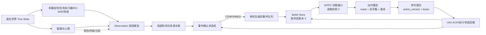
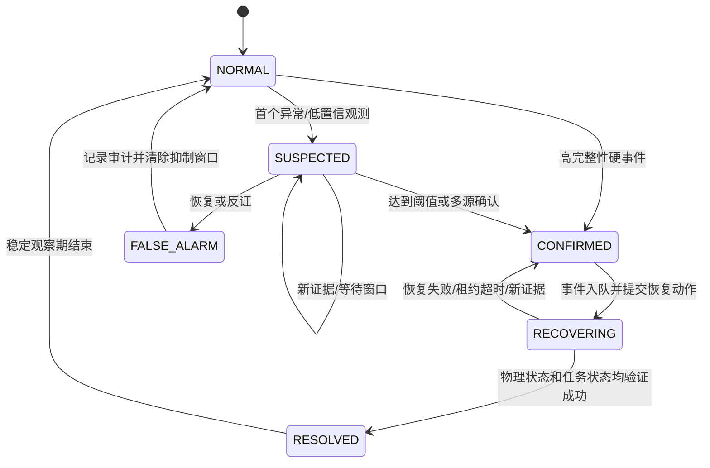

# 多无人机真实事件探查与并发重分配机制设计

> 文档性质：研究与仿真设计，不是现有代码功能声明，也不是飞行安全认证方案。  
> 适用背景：多无人机区域搜索、目标发现后转入跟踪、无人机故障、目标毁伤、区域空缺，以及丢包、时延和网络分区条件下的动态任务重分配。  
> 实施边界：本文不修改原 `ppo_allocation`，不实现 GPPO/AHGNN/Adaptive Gate，不训练模型，不搭建基线或评估器。

## 1. 先给结论

真实系统不能把“仿真随机事件发生”直接等同于“调度器已经知道事件”。必须把系统拆成两层：

1. **True State（真实状态）**：无人机是否真的损坏、目标是否真的出现/被摧毁、链路是否真的中断。
2. **Belief State（系统认知）**：控制系统根据自检、传感器、心跳、邻机和地面站报告形成的带置信度、时效性和版本号的判断。

只有事件达到 `CONFIRMED`，或者属于必须立即执行安全动作的高完整性硬故障，才释放原任务并把新的图状态提交给 GPPO。普通事件到来时，不中断不受影响的无人机；新事件通过优先队列、状态版本、动作版本、ACK 和任务租约与正在进行的推理及执行协调。

推荐的闭环是：



这不是“检测到事件就立刻重新跑一次模型”这么简单。完整机制至少包括：探测、确认、排队、构图、推理、提交、执行确认和物理恢复八个阶段。

## 2. 证据等级与现有代码边界

本文对每项结论使用三种来源等级：

| 标记 | 含义 | 可以怎样表述 |
|---|---|---|
| **[P] 论文明确** | 第一篇论文正文或图中直接给出 | 可称为论文机制 |
| **[E] 工程补充** | 为把论文机制落到真实异步系统而提出的设计 | 只能称为本文建议/拟议方案 |
| **[H] 硬件验证** | 阈值或可靠性受传感器、飞控、链路和任务场景影响 | 必须经日志、HIL 或实飞标定，不能直接定论 |

### 2.1 论文真正说明了什么

- **[P]** 采用事件触发的动态任务重分配，而不是每一时刻都全量通信。
- **[P]** leader-follower 结构中按固定间隔进行多节点 heartbeat，用于识别不工作的 UAV；故障 UAV 的任务要重分配，leader 故障后由后续编号 UAV 接替。
- **[P]** 动态同步要更新任务分配状态、UAV 可用性、任务依赖、图邻接关系、特征和动态动作集合/掩码。
- **[P]** 正常通信可做全局重分配；受限通信下采用局部信息、局部重分配和多节点验证。

论文依据位于第一篇论文第 19109 页的 event-trigger 与 heartbeat 描述、第 19112–19113 页的动态同步描述，以及第 19114 页 Fig. 5 的正常/受限通信处理流程。

### 2.2 论文没有说明什么

- **[E]** 心跳丢几次才算故障、是否主动探测、误报如何撤销。
- **[E]** 目标发现/毁伤的置信度、连续帧和多传感器确认规则。
- **[E]** GPPO 推理期间又来事件时如何作废旧动作。
- **[E]** 命令发出无 ACK、网络分区和两方同时分配同一任务时如何处理。
- **[E]** 状态版本、动作版本、租约、fencing token、撤销和恢复协议。
- **[H]** 所有具体秒数、阈值、误警率和传感器性能。

### 2.3 当前代码真正实现到哪里

原 `ppo_allocation` 的 `reallocation_service.py` 接收已经确定的事件字典，然后立即改变环境状态：例如 `UAV_DAMAGE` 直接令 `alive=False` 并释放区域；`TARGET_DISCOVERED` 直接令发现者进入 `TRACK`；`TARGET_DESTROYED` 直接释放跟踪机。随机环境同样先直接改变 true state，再构造事件。因此它适合验证“事件已知以后怎么分配”，**没有实现真实探测与确认过程**。

本仓库的 `paper_env.py` 已有固定间隔 heartbeat 和 timeout 记录，能作为仿真骨架；但它仍不等于下文所设计的多源确认、并发事务和命令闭环。

## 3. 总体事件模型：事实、观测、判断必须分开

### 3.1 三类对象

```text
TruthEvent       真实事件，仅仿真器/物理世界知道
Observation      某传感器或节点在某时刻看到了什么
ConfirmedEvent   系统融合观测后接受的任务级事件
```

建议最小字段如下：

```json
{
  "event_id": "evt-...",
  "event_type": "UAV_DAMAGE",
  "entity_id": "U2",
  "status": "CONFIRMED",
  "confidence": 0.96,
  "occurred_at": 12.20,
  "first_observed_at": 12.35,
  "confirmed_at": 13.40,
  "queued_at": 13.41,
  "handled_at": null,
  "resolved_at": null,
  "evidence_ids": ["obs-31", "obs-32"],
  "graph_version_at_confirm": 84,
  "caused_events": ["vacancy-R3"],
  "source_class": "onboard_self_test"
}
```

### 3.2 为什么一定要保留 True 与 Belief

| 时刻 | True State | Belief State | 调度器应做什么 |
|---|---|---|---|
| U2 已断电，心跳刚丢 1 次 | U2 故障 | U2 仍可能正常 | 暂停给 U2 新增任务；不马上释放现有任务 |
| 心跳连续丢失且主动探测失败 | U2 故障 | U2 `CONFIRMED` 不可用 | 释放 U2 的任务，更新图和 mask，触发 GPPO |
| 仅网络分区，U2 实际正常 | U2 正常 | U2 `SUSPECTED` 失联 | 不把“失联”直接写成“损毁”；按租约和分区规则处理 |
| 通信恢复并收到带新序列号的健康遥测 | U2 正常 | 旧故障判断被反证 | 进入 `FALSE_ALARM/RECOVERING`，同步后再恢复候选资格 |

如果省略 Belief，仿真会让 GPPO获得不可能的“上帝视角”；如果省略 True，就无法统计漏报、误报和检测延迟。

## 4. 四类事件如何在真实系统中被探查

### 4.1 `UAV_DAMAGE`：无人机故障/损毁

| 观测源 | 典型信号 | 初始判断 | 确认方法 | 任务处理 |
|---|---|---|---|---|
| 飞控自检 **[E/H]** | 电机停转、ESC 故障、姿态发散、飞控重启、关键总线故障 | 严重硬故障可直接 `CONFIRMED`；软异常进入 `SUSPECTED` | 故障码完整性校验；冗余 IMU/电源交叉检查 | 安全动作优先；确认后立即冻结新任务并释放不可继续执行的租约 |
| 电池/能源 **[E/H]** | 欠压、剩余航时低于返航需求、电流异常 | `SUSPECTED` 或能力退化，不必都叫 DAMAGE | 连续采样、负载校正、返航裕度计算 | 能继续安全飞行时降低能力；不能执行任务时确认不可用 |
| 导航/姿态 **[E/H]** | GNSS/INS 不一致、位置跳变、航迹失控 | `SUSPECTED` | 多源导航一致性、邻机相对定位、地面雷达确认 | 暂停新分配，必要时紧急脱离/返航 |
| 主动上报 **[E]** | UAV 发送 `MAYDAY/FAILURE` | 高完整性上报可直接确认 | 消息签名、递增序列号、故障码 | 高优先级事件，绕过合并等待 |
| heartbeat **[P/E]** | 固定周期心跳连续缺失 | 先 `SUSPECTED`，不能直接等同损毁 | 主动 probe、邻机/leader/地面站交叉确认；超时后确认“不可调度” | 释放租约并触发重分配，但事件原因保留为 `lost_contact` 或 `damage` |
| 邻机/地面站 **[E/H]** | 视觉看到坠毁、ADS-B/雷达航迹消失、邻机收不到广播 | 支持性证据 | 与自检/心跳形成二源确认 | 作为多节点验证的一部分 |

**关键区分：**“UAV 损毁”和“UAV 暂时失联”不能只用一个布尔值表示。建议资源状态至少为 `HEALTHY / DEGRADED / LOST_CONTACT / FAILED / RECOVERING`。在 `LOST_CONTACT` 下，调度器可以把 UAV 暂时从新动作 mask 中移除，但是否释放其正在执行的任务由租约和任务安全等级决定。

**触发 GPPO 的时机：**

- 飞控报告不可恢复的硬故障：收到可信报告后立即 `CONFIRMED` 并触发。
- 仅 heartbeat 丢失：进入 `SUSPECTED`，主动 probe；达到确认超时或得到第二来源确认后触发。
- 单次丢包：不触发。

### 4.2 `TARGET_DISCOVERED`：目标发现并转入跟踪

| 阶段 | 建议机制 **[E/H]** | 对任务的影响 |
|---|---|---|
| 候选检测 | EO/IR/SAR 检测器输出类别、置信度、框/散射点、位置协方差、region_id | 创建候选目标，不释放搜索任务 |
| 时间确认 | 连续 `N-of-M` 帧命中；使用航迹门限排除闪烁误检 | `SUSPECTED → CONFIRMED` |
| 空间/多源确认 | EO 与 SAR、两架 UAV、机载与地面源交叉验证 | 提高置信度并确定 target_id |
| 定位 | 把检测坐标映射到区域，保存位置误差和时间戳 | 更新目标节点及其边，而非只写一个 discovered 布尔值 |
| 跟踪接管 | 发现者先申请 TRACK lease，收到执行 ACK 后才正式成为 tracker | 避免搜索任务先被释放而 TRACK 又没建立 |
| 产生空缺 | TRACK lease 生效后，发现者的原 SEARCH lease 被撤销/到期 | 派生 `REGION_VACANCY` 并触发 GPPO 补位 |

因此真实闭环应是两阶段切换：

```text
目标确认 → 预留 TRACK → UAV ACK 能跟踪 → TRACK lease 生效
       → 撤销原 SEARCH lease → 区域空缺确认 → GPPO 重分配
```

如果 UAV 拒绝/超时未 ACK TRACK，原搜索任务不应被系统提前永久释放；可以选择其他 tracker 或维持临时观察。

### 4.3 `TARGET_DESTROYED`：目标毁伤确认

“目标暂时丢失”不等于“目标被摧毁”。建议状态为：

```text
TRACKING → LOST_SUSPECTED → REACQUIRED
                       └→ DESTROYED_CONFIRMED
```

| 证据 | 只能说明什么 | 是否可释放 tracker |
|---|---|---|
| 单帧目标消失 | 遮挡、检测失败或离开视场 | 否 |
| 连续多帧丢失但目标可能机动 | `LOST_SUSPECTED` | 否；执行预测搜索/扩大搜索门 |
| 命中/爆炸视觉 + 热特征消失 | 强毁伤证据 | 仍建议做时间或第二来源确认 |
| 两独立传感器确认残骸/不可动 | `DESTROYED_CONFIRMED` | 是 |
| 上级指挥系统签发已毁伤消息 | 外部权威事件 | 经认证与版本校验后可以 |

**释放条件 [E/H]：**目标达到 `DESTROYED_CONFIRMED`，或者任务规则明确允许在长期失联后把它转成新的“目标搜索任务”。前者释放 tracker；后者不是毁伤确认，而是把 TRACK 转成 reacquisition/search，不能伪记为 destroyed。

### 4.4 `REGION_VACANCY`：区域空缺

区域空缺通常是一个**派生事件**，不是某个传感器直接“看见”的物理事件。确认条件是：某区域需要持续搜索，但当前没有有效、已 ACK 且未过期的 SEARCH lease holder。

| 原因 | 空缺成立条件 **[E]** | GPPO 触发 |
|---|---|---|
| UAV 故障 | 故障确认，或故障 UAV 的任务 lease 已失效 | 是 |
| 搜索机转 TRACK | TRACK lease 已 ACK，旧 SEARCH lease 已撤销 | 是 |
| 分配 lease 超时 | 到期且续租失败 | 是；同时保留 `cause=lease_expired` |
| 指挥撤销 | revoke 被接受，或 fencing token 已使旧命令失效 | 是 |
| 执行失败 | UAV ACK `REJECTED/FAILED` 或超时后状态核验失败 | 是 |
| 短时链路抖动 | lease 尚有效，任务可能仍在执行 | 否，不应制造虚假空缺 |

同一根因产生的 `UAV_DAMAGE(U2)` 与多个 `REGION_VACANCY(R1,R3)` 要用 `caused_by_event_id` 关联并批处理，避免为每个区域重复调用一次 GPPO。

## 5. 通用确认状态机

### 5.1 状态与转移



| 状态 | 系统含义 | 是否释放任务 | 是否触发 GPPO | 是否重新成为候选 |
|---|---|---:|---:|---:|
| `NORMAL` | 当前无可信异常 | 否 | 否 | 是 |
| `SUSPECTED` | 有异常但证据不足 | 默认否；暂停新任务可选 | 否 | 可从新动作 mask 暂时移除 |
| `CONFIRMED` | 事件已达到任务级确认 | 按事件语义释放/转换 | 是 | 否 |
| `RECOVERING` | 恢复动作已提交或执行中 | 由新 lease 控制 | 仅恢复失败或新冲突时再次触发 | 否 |
| `RESOLVED` | 物理和任务级验收已通过 | 不再变更 | 否 | 经过稳定期后是 |
| `FALSE_ALARM` | 原怀疑被反证 | 不释放；若已预防性冻结则撤销 | 否 | 同步并稳定后是 |

### 5.2 什么时候释放任务

任务释放不是检测器自己的单边操作，而是资源/任务管理器的一次带版本事务：

1. 确认事件或确认 lease 已失效；
2. 把旧 assignment 标成 `REVOKING`；
3. 递增任务 fencing token；
4. 旧 UAV 即便随后发来迟到 ACK，也不能继续拥有该任务；
5. 区域进入 `VACANT_CONFIRMED`，再参与 GPPO 动作集合。

### 5.3 什么时候恢复 UAV 的候选资格

故障/失联 UAV 恢复后不能一收到单个心跳就马上重新分配。建议满足：

- 连续健康心跳达到恢复门限；
- 飞控、能源、导航和载荷状态通过自检；
- 与当前 leader 同步最新 `graph_version`、任务 token 和时钟；
- 清除/拒绝所有旧 action version；
- 经过恢复稳定期后，从 `RECOVERING → RESOLVED → NORMAL`。

## 6. 六个时间字段与三类时延

每个事件必须记录：

| 字段 | 定义 | 谁写入 |
|---|---|---|
| `occurred_at` | 真实事件在物理世界发生时间；真实系统中可能未知或后估计 | 仿真器或事后融合器 |
| `first_observed_at` | 任一传感器第一次观测到异常的采样时间 | 观测源 |
| `confirmed_at` | 状态机进入 `CONFIRMED` 的时间 | 事件融合器 |
| `queued_at` | 已确认事件进入调度队列的时间 | 事件总线/队列 |
| `handled_at` | 对该事件的新动作完成验证并提交的时间 | 调度协调器 |
| `resolved_at` | UAV ACK、物理执行和任务覆盖均通过验收的时间 | 恢复管理器 |

建议同时保存 `received_at`，用于把传感器采样延迟与网络传输延迟分开。

公式：

```text
检测时延 T_detect   = confirmed_at - occurred_at
决策时延 T_decision = handled_at - queued_at
确认后处理总耗时 T_post_confirm = handled_at - confirmed_at
物理执行时延 T_execute = resolved_at - handled_at
恢复时延 T_recovery = resolved_at - occurred_at
```

若真实系统不知道精确 `occurred_at`，报告 `T_detect_upper = confirmed_at - last_known_normal_at` 和 `T_detect_lower = confirmed_at - first_observed_at`，不要伪造精确值。

## 7. 并发事件处理协议

### 7.1 默认原则

1. **不受影响任务继续执行。**事件只冻结其资源和任务读写集。
2. **安全事件可抢占，普通事件不强制中断。**
3. **推理可以并行，提交必须串行验证。**GPPO 输出不是命令，必须在最新状态上重新过 mask 和版本校验。
4. **命令无 ACK 不等于未执行，也不等于已执行。**由 action 状态机和 lease 消除歧义。
5. **分区时宁可短期不重分配，也不能让同一排他任务被两个持有者同时合法执行。**

### 7.2 优先级队列

| 优先级 | 事件 | 处理方式 |
|---|---|---|
| P0 紧急安全 | 飞控硬故障、碰撞风险、失控、极低能源 | 立即抢占；绕过 merge window；先执行安全规则，再谈分配 |
| P1 资源失效 | UAV 确认损毁、失联 lease 到期、执行失败 | 作废冲突动作，更新图后尽快 GPPO |
| P2 任务语义变化 | 目标确认、目标毁伤、区域空缺 | 可在短 merge window 内合并成一个图版本 |
| P3 优化/低紧迫变化 | 轻微能力退化、非关键优先级变化 | 可延迟到下一决策边界 |

同优先级排序键建议为：`(priority, confirmed_at, event_id)`。`event_id` 只用于确定性打破平局，不能代表物理先后。

### 7.3 图版本和动作版本

每次确认事件的原子批次使 `graph_version` 加一。GPPO 输入快照包含：

```text
snapshot = {
  graph_version,
  topology_epoch,
  node/edge features,
  action_mask,
  assignment_leases,
  read_set
}
```

GPPO 返回：

```text
proposal = {
  based_on_graph_version,
  action_version,
  selected UAV-task edges,
  read_set,
  write_set,
  created_at,
  expires_at
}
```

提交规则 **[E]**：

- 若当前 `graph_version` 等于输入版本，重算 mask 后可提交。
- 若版本已变化，但新事件与 proposal 的 `read_set/write_set` 不相交，可局部重验后提交。
- 若新事件改变了候选 UAV、目标任务、前序约束、通信可达性或 lease，则旧动作作废，重新构图和推理。
- P0/P1 事件到来时，任何使用受影响资源的未提交/未 ACK 动作立即作废。

这比“只要版本变了就把全体动作丢弃”更高效，也比“模型算完就照发”更安全。

### 7.4 动作、ACK 与租约状态机

```text
PROPOSED → VALIDATED → COMMITTED → ACKED → EXECUTING → COMPLETED
                  └────────────→ REJECTED
                         └──────→ ACK_TIMEOUT → QUERY/RETRY/REVOKE
                                       └──────→ EXPIRED
任意未完成状态可被更高 fencing token 置为 REVOKED
```

- `ACK_ACCEPTED`：UAV 收到命令且接受，不代表已抵达或任务已完成。
- `ACK_EXECUTING`：物理执行已开始。
- `ACK_REJECTED`：能力、能源、局部障碍或版本不满足；立即产生执行失败事件。
- `ACK_TIMEOUT`：先查询和比对遥测；重发必须携带相同幂等 action id，禁止生成重复任务。
- `lease_expiry`：到期未续租后旧执行权失效；新分配使用更大的 fencing token。

### 7.5 merge window 与紧急抢占

在很短时间内确认的 P1/P2 事件应合并，例如 `U2_DAMAGE` 同时导致 R1、R3 空缺，只生成一个图版本、一次 GPPO 决策。merge window 不是等待安全事件的借口：P0 立即处理；P1 是否等待由剩余安全裕度决定；P2/P3 才适合常规合并。

### 7.6 网络分区

弱通信下建议：

1. 维护 `leader_term/topology_epoch`；新 leader 的命令必须有更高 term。
2. 每个排他任务使用中心或法定仲裁方签发的 fencing token。
3. 分区内部只对本分区可验证资源做局部重分配；不把不可见 UAV 直接判死。
4. 如果无法获得新 token，允许已有 lease 在限定期限内继续，但不创建冲突的新 owner。
5. 分区恢复后交换事件日志、最高 token 和任务进度；低 term/低 token 的迟到命令全部拒绝。
6. 对可重复的非排他搜索覆盖，可允许临时冗余，但必须在任务类型中显式声明 `exclusive=false`。

## 8. 建议仿真参数（不是论文或标准值）

下表仅用于第一轮离散事件仿真，全部属于 **[E] 工程初值**，并标记为需要 **[H] 日志/HIL/实飞校准**。

| 参数 | 建议扫描范围 | 起始默认值 | 设计理由/校准方法 |
|---|---:|---:|---|
| heartbeat interval | 0.5–2.0 s | 1.0 s | 论文只说明固定间隔；按链路负载与最大可接受探测时延校准 |
| heartbeat 连续丢失数 | 3–5 次 | 3 次 | 避免单包丢失直接误报 |
| 主动 probe 等待 | 0.5–2.0 s | 1.0 s | 覆盖往返时延高分位数 |
| 失联确认总超时 | 4–10 s | 5.0 s | 应大于 heartbeat 怀疑时间 + probe 时间 |
| 恢复健康心跳数 | 3–5 次 | 3 次 | 防止刚恢复又抖动 |
| 目标确认 N-of-M | N=3–5，M=5–8 | 3-of-5 | 与检测帧率、目标速度和误警率联调 |
| 候选目标置信度 | 0.55–0.75 | 0.60 | 只进入 SUSPECTED |
| 高置信阈值 | 0.80–0.95 | 0.85 | 仍需按检测器校准曲线选择 |
| 跟踪丢失等待 | 2–8 s | 4.0 s | 应覆盖短时遮挡，不等同毁伤确认 |
| 事件 merge window | 50–250 ms | 100 ms | 合并同一物理根因产生的连锁事件 |
| GPPO 推理 deadline | 100–500 ms | 200 ms | 超时后使用安全/贪心回退策略，本文不实现该策略 |
| 命令 ACK timeout | 0.5–3.0 s | 1.0 s | 取链路 RTT 高分位数并留裕度 |
| assignment lease | 3–10 s | 5.0 s | 至少覆盖 3 个 heartbeat 或 2 个 ACK 周期 |
| lease renew interval | lease 的 1/4–1/3 | 1.5 s | 在到期前有多次续租机会 |
| action version TTL | 0.2–2.0 s | 0.5 s | 限制过时决策窗口；还需版本重验 |
| FALSE_ALARM 抑制窗口 | 2–10 s | 5.0 s | 防止同一抖动反复告警，但 P0 不受抑制 |

参数不能只选一个点。建议至少设置 `optimistic/nominal/stressed` 三档，并对丢包率、时延和探测噪声做联合扫描。

## 9. 十四个可直接转成仿真测试的时间线

每个案例都明确真值、系统认知、观测、状态变化、是否触发 GPPO、现有任务是否继续、旧动作是否失效和最终处理。

### 案例 1：U1 主动报告硬故障

- **时间线**：t=10.00 U1 电机控制器硬故障；t=10.05 发送签名 `FAILURE`；t=10.10 leader 收到。
- **True / Belief**：True=FAILED；收到前 Belief=NORMAL，收到可信硬故障后直接 `CONFIRMED`。
- **信号与状态**：飞控硬故障码；`NORMAL → CONFIRMED → RECOVERING`。
- **GPPO**：触发；U1 和它持有的任务进入冲突写集。
- **当前任务**：其他 UAV 继续；U1 执行安全处置，其搜索任务被释放。
- **旧动作**：所有引用 U1 的未提交/未 ACK 动作立即作废。
- **最终解决**：新任务 lease 被其他 UAV ACK 且覆盖恢复后 `RESOLVED`。

### 案例 2：U2 静默掉电，仅心跳可见

- **时间线**：t=20.20 掉电；21/22/23 s 心跳均缺失；t=23.05 `SUSPECTED`；主动 probe 等待到 t=24.05；邻机也无法发现；t=24.10 `CONFIRMED`。
- **True / Belief**：True 在 20.20 已故障；Belief 到 24.10 才确认。
- **信号与状态**：连续三次 heartbeat loss + probe timeout + 邻机证据。
- **GPPO**：23.05 不触发；24.10 触发。
- **当前任务**：其他 UAV 继续；U2 的 lease 在确认或到期前被标记 uncertain，不新增任务。
- **旧动作**：确认后引用 U2 的动作失效。
- **最终解决**：记录约 3.9 s 检测时延；重分配 ACK 后解决。

### 案例 3：单次丢包，不产生虚假故障

- **时间线**：t=30 心跳丢失；t=31 下一心跳正常到达。
- **True / Belief**：True=HEALTHY；Belief 仅有一次缺包，不越过怀疑门限。
- **信号与状态**：可记录链路异常，但 UAV 保持 `NORMAL`。
- **GPPO**：不触发。
- **当前任务**：全部继续。
- **旧动作**：不失效。
- **最终解决**：作为通信统计，不生成 UAV_DAMAGE。

### 案例 4：连续丢包造成怀疑，随后通信恢复

- **时间线**：t=40/41/42 连续缺心跳，t=42.05 `SUSPECTED`；t=42.50 收到序列连续、时间戳有效的健康遥测；t=42.60 主动 probe 成功。
- **True / Belief**：True=HEALTHY；Belief `NORMAL → SUSPECTED → FALSE_ALARM → NORMAL`。
- **信号与状态**：链路恢复和飞控健康状态构成反证。
- **GPPO**：不触发正式重分配；如已做预防性 mask，撤销冻结。
- **当前任务**：原 lease 未到期则继续。
- **旧动作**：与 U2 无关的动作有效；若引用 U2，可在最新版本重验后恢复。
- **最终解决**：记一次 false alarm，而不是“UAV 复活”。

### 案例 5：U0 发现目标并成功转 TRACK

- **时间线**：t=50.00 首帧检测；50.20 完成 3-of-5；50.25 多源融合确认；50.30 下发 TRACK；50.45 ACK；50.50 TRACK lease 生效并撤销 U0 的 SEARCH lease。
- **True / Belief**：True 目标已出现；Belief 从候选到 `CONFIRMED`。
- **信号与状态**：EO/SAR 连续帧、位置协方差、target_id；事件 `CONFIRMED → RECOVERING`。
- **GPPO**：目标确认本身更新图；U0 TRACK ACK 后产生区域空缺并触发一次合并决策。
- **当前任务**：其他 UAV 继续；U0 在 ACK 前仍维持临时观察/原搜索责任。
- **旧动作**：把 U0 分给其他 SEARCH 的未提交动作在 TRACK lease 生效时失效。
- **最终解决**：目标稳定跟踪且空缺区域重新覆盖后 `RESOLVED`。

### 案例 6：目标疑似发现但后续帧反证

- **时间线**：t=60.00 单帧高亮；后续 4 帧均不匹配；t=60.50 候选关闭。
- **True / Belief**：True=无目标；Belief `NORMAL → SUSPECTED → FALSE_ALARM`。
- **信号与状态**：未通过 N-of-M 和航迹门限。
- **GPPO**：不触发。
- **当前任务**：全部继续，发现者不转 TRACK。
- **旧动作**：有效。
- **最终解决**：保存误检样本供检测器校准。

### 案例 7：GPPO 推理期间另一架 UAV 故障

- **时间线**：t=70.00 因 R1 空缺，GPPO 读取图 V=100；t=70.08 U3 硬故障确认，图变 V=101；t=70.15 模型返回把 R1 分给 U3 的动作。
- **True / Belief**：推理输入时 U3 可用，返回时已不可用。
- **信号与状态**：P1 事件改变 proposal 的 read/write set。
- **GPPO**：旧 proposal 不提交；基于 V=101 重新推理。
- **当前任务**：不涉及 U3 的任务继续；U3 任务释放。
- **旧动作**：失效，因为引用已故障资源。
- **最终解决**：新动作通过最新 mask、版本和 lease 校验后提交。

### 案例 8：动作已发送无 ACK，随后又来目标毁伤事件

- **时间线**：t=80.00 action A(V=120) 指派 U2→R3；80.20 未收到 ACK；80.30 T5 毁伤确认并释放 U1；80.50 A 仍未 ACK。
- **True / Belief**：系统不知道 A 是丢包还是已执行；新事件使 U1 成为新候选。
- **信号与状态**：A=`ACK_TIMEOUT`；TARGET_DESTROYED=`CONFIRMED`。
- **GPPO**：先查询 U2 状态；若无法确认，递增 R3 fencing token 并撤销 A，再将 U1 纳入新图。
- **当前任务**：其他任务继续；U2 在旧 token 下不能同时成为新 owner。
- **旧动作**：被显式 revoke/expiry 后失效，不能仅靠“没 ACK”猜测。
- **最终解决**：收到迟到 A ACK 时因 token 过旧而拒绝；新 lease ACK 后解决。

### 案例 9：跟踪期间目标短时丢失，但不能判定毁伤

- **时间线**：t=90.00 T2 离开视场；90–93 s 连续未检测；t=93.20 在预测门内重新捕获。
- **True / Belief**：True=目标存活；Belief `TRACKING → LOST_SUSPECTED → REACQUIRED`。
- **信号与状态**：单源丢失，未见毁伤证据。
- **GPPO**：不触发释放 tracker；可触发局部 reacquisition 行为，但不是 TARGET_DESTROYED。
- **当前任务**：tracker 继续跟踪搜索，其他任务继续。
- **旧动作**：不失效。
- **最终解决**：恢复跟踪；统计 track interruption，不统计目标毁伤。

### 案例 10：跟踪确认时发现者同时故障

- **时间线**：t=100.00 U0 报告目标候选；100.30 目标确认；100.35 下发 TRACK；100.38 U0 硬故障，尚未 ACK TRACK。
- **True / Belief**：目标真实存在，U0 不可用；两个事件均确认。
- **信号与状态**：P0/P1 故障抢占 P2 跟踪转换。
- **GPPO**：撤销 U0 TRACK proposal；图中保留目标节点，重新选择可用 tracker，并同时处理原搜索任务。
- **当前任务**：其他 UAV 继续；U0 任务释放。
- **旧动作**：U0 的 TRACK 与 SEARCH 动作全部失效。
- **最终解决**：新 tracker ACK 后再确认区域空缺和搜索补位。

### 案例 11：网络分区中两个 leader 产生冲突意图

- **时间线**：t=110 网络分为 A/B；A 分区以 term=8、token=41 续租 R2 给 U1；B 分区旧 leader term=7 尝试把 R2 分给 U4；t=118 网络恢复。
- **True / Belief**：两边 belief 不一致；真实任务可能被重复覆盖。
- **信号与状态**：拓扑 epoch 变化；B 无法取得更高 fencing token。
- **GPPO**：两边可本地推理，但 B 的排他分配不能合法提交；仅允许已有 lease 或显式非排他冗余任务。
- **当前任务**：各分区不受影响任务继续。
- **旧动作**：恢复后 term=7/token 较低的动作失效。
- **最终解决**：交换事件日志和 token，以 term=8/token=41 为准，必要时向 U4 发 revoke。

### 案例 12：同一 100 ms 内出现三类连锁事件

- **时间线**：t=120.000 U2 失效确认；120.030 R1/R3 lease 失效；120.070 T4 毁伤确认释放 U0；均落入一个 100 ms merge window。
- **True / Belief**：多个真实变化被分别确认，但具有重叠资源/任务影响。
- **信号与状态**：P1+P2 批次，根因链保留。
- **GPPO**：只构造一次 V→V+1 的原子图快照并决策，不连续跑三次相互覆盖的动作。
- **当前任务**：U1/U3 等未受影响任务继续。
- **旧动作**：只作废与 U2、R1、R3、U0 新可用性相冲突的 proposal。
- **最终解决**：批量新 lease 全部 ACK 或分别进入失败补偿；事件各自记录 resolved_at。

### 案例 13：重分配动作正在执行，又出现无关普通事件

- **时间线**：t=130.00 U3 已 ACK 并正在飞往 R1；t=130.40 R4 因 U4 的 SEARCH lease 到期形成空缺；U3→R1 与 R4/U4 的读写集不相交。
- **True / Belief**：U3 的恢复动作真实处于 EXECUTING；R4 空缺已确认并进入 Belief V+1。
- **信号与状态**：原事件保持 `RECOVERING`；新事件为 P2 `CONFIRMED`。
- **GPPO**：允许针对 R4 构造增量决策；U3→R1 不被普通事件打断。
- **当前任务**：U3 继续执行，其他不相关任务也继续。
- **旧动作**：虽然全局图版本变化，但 U3→R1 因读写集不相交仍有效；只对新 proposal 做最新版本重验。
- **最终解决**：两个事件分别拥有 handled_at/resolved_at；R1 到达验收和 R4 新 lease ACK 互不覆盖。

### 案例 14：两个事件具有完全相同的确认时间

- **时间线**：t=140.000 leader 同一批消息中确认 `U1_DAMAGE` 和 `TARGET_DISCOVERED(T7,U2)`；两者 `confirmed_at` 完全相同。
- **True / Belief**：U1 已故障，T7 已被 U2 发现；Belief 必须把两个事实原子地写入同一个新图版本。
- **信号与状态**：P1 与 P2 同时到达；使用优先级和 event_id 只确定日志顺序，不分两次改图。
- **GPPO**：基于合并快照同时移除 U1、建立 T7 节点、预留 U2 TRACK，并处理由两者派生的空缺。
- **当前任务**：U1 停止，U2 按 TRACK 两阶段切换；其他任务继续。
- **旧动作**：引用 U1 或把 U2 分给新 SEARCH 的动作失效；无关动作可局部重验。
- **最终解决**：分别验证替代 U1 的任务和 T7 跟踪/搜索补位；两个事件保留独立因果链和 resolved_at。

## 10. 推荐接口（仅设计，不实现）

### 10.1 探测与融合

```python
observe_signal(observation: Observation) -> None
advance_confirmation(now: float) -> list[ConfirmedEvent]
cancel_suspicion(event_id: str, evidence: Observation) -> None
```

`Observation` 至少应包含 `source_id/source_type/sample_at/received_at/sequence/confidence/payload/signature`。

### 10.2 状态与决策

```python
apply_confirmed_events(events: list[ConfirmedEvent]) -> GraphSnapshot
build_decision_snapshot(affected_set: ResourceTaskSet) -> DecisionSnapshot
infer(snapshot: DecisionSnapshot) -> ActionProposal
validate_proposal(proposal: ActionProposal, latest_state: BeliefState) -> ValidationResult
```

### 10.3 提交与执行

```python
commit_action(proposal, lease_policy) -> AllocationCommand
record_ack(action_id, ack_type, uav_state) -> None
revoke_action(action_id, new_fencing_token, reason) -> None
expire_leases(now: float) -> list[ConfirmedEvent]
resolve_event(event_id, evidence_ids) -> None
```

### 10.4 随机事件环境的正确接入方式

为了主要测试随机事件触发效果，仿真器应按以下方式接入，而不是复用现有“直接改状态再通知模型”的捷径：

```text
固定 seed 生成 TruthEvent tape
→ 修改仿真 True State
→ 按传感器模型生成带漏检/误警/延迟/丢包的 Observation tape
→ 确认状态机更新 Belief
→ ConfirmedEvent 才更新 GPPO 图状态与动作 mask
→ 版本验证、命令、ACK、lease
→ 物理执行反馈更新 True/Belief
```

同一条 truth tape 必须供不同算法共享；observation tape 也应固定重放，才能把“探测随机性”和“策略随机性”分开。

## 11. 应记录的指标和验收问题

### 11.1 探测指标

- 每类事件 precision、recall、false alarm rate、miss rate。
- `T_detect` 的均值、P50、P95、最大值。
- `SUSPECTED → CONFIRMED/FALSE_ALARM` 比例。
- 真故障被误当链路分区、链路分区被误当损毁的混淆矩阵。

### 11.2 并发与一致性指标

- stale proposal rejection rate，以及是否存在漏拒绝。
- 同一排他任务的同时有效 lease 数，目标必须始终 `≤1`。
- ACK timeout、迟到 ACK、重复命令和幂等去重数量。
- 事件 merge 比例、被抢占决策数、重新推理次数。
- 网络分区恢复后的冲突持续时间和状态收敛时间。
- 不受影响任务的中断次数/中断时长，理想目标为 0。

### 11.3 任务恢复指标

- `T_decision`、`T_recovery`、`T_e2e` 分布。
- 空缺区域时长积分：`∫ vacant_regions(t) dt`。
- 目标发现到 TRACK lease 生效的时间。
- 故障到原任务重新拥有有效 owner 的时间。
- 因误报造成的无谓任务撤销次数。

### 11.4 第一轮确定性验收建议 **[E]**

1. 单次 heartbeat 丢失绝不产生 UAV_DAMAGE。
2. 通信恢复案例必须进入 FALSE_ALARM，且不释放仍有效 lease。
3. GPPO 推理期间候选 UAV 故障，旧动作必须 100% 被拒绝。
4. 迟到 ACK 携带旧 token 时必须 100% 被拒绝。
5. 任意测试时刻，同一排他任务的有效 lease 不超过一个。
6. 普通事件不得中断读写集之外的任务。
7. TARGET_LOST 不能被统计成 TARGET_DESTROYED。
8. 同一根因的多个 vacancy 在 merge window 内只触发一次图决策。

这些是协议一致性目标，不是论文报告过的性能数字。

## 12. 从设计到后续实现的推荐顺序

1. 先定义 `TruthEvent / Observation / ConfirmedEvent` 数据结构和六个时间字段。
2. 在不接 GPPO 的情况下完成确认状态机及 14 个确定性时间线单元测试。
3. 增加 graph/state version、action version、ACK、lease 和 fencing token 模拟器。
4. 用固定 truth/observation tapes 测并发一致性，不讨论学习性能。
5. 最后才把 `ConfirmedEvent → GraphSnapshot → GPPO` 接上，并与旧直接注入路径隔离。
6. 参数先做软件仿真敏感性分析，再用 SIL/HIL 日志标定，最终才做受控实飞。

## 13. 论文、工程设计与硬件验证的最终分界

| 内容 | 归类 | 结论边界 |
|---|---|---|
| 固定间隔 heartbeat 识别不工作 UAV | **[P]** | 论文给出机制，不给具体阈值 |
| 事件触发而非持续全量通信 | **[P]** | 论文核心框架之一 |
| 正常通信全局重分配、弱通信局部重分配与多节点验证 | **[P]** | 论文流程级描述 |
| 事件后更新图、特征和动态动作集合 | **[P]** | 与 GPPO 图决策接口直接相关 |
| NORMAL/SUSPECTED/CONFIRMED 等状态机 | **[E]** | 本文为真实异步系统补充 |
| EO/SAR 连续帧、多源目标确认 | **[E/H]** | 逻辑可仿真，阈值需传感器标定 |
| ACK、lease、版本、fencing token | **[E]** | 并发一致性协议，不是论文原文创新 |
| heartbeat=1 s、3 次丢失、ACK=1 s 等参数 | **[E/H]** | 仅仿真初值，绝不能写成论文参数或行业标准 |
| 故障识别准确率和恢复时延是否满足真实任务 | **[H]** | 必须通过链路日志、HIL 和实飞验证 |

## 14. 可用于开题/汇报的一句话

> 第一篇论文提供了“事件触发、图状态更新、动态动作集合以及弱通信下局部重分配”的决策框架；本设计补齐了论文未展开的真实事件探测与并发控制层，使物理扰动先经过多源观测和确认，再以带版本的图事件触发 GPPO，并通过 ACK、租约和 fencing token 保证新旧事件重叠时不产生过时分配或双重任务所有权。

## 15. 设计输入与可追溯位置

| 输入 | 用途 | 边界 |
|---|---|---|
| 第一篇论文第 19109、19112–19114 页 | event-trigger、固定间隔 heartbeat、动态同步、正常/受限通信重分配流程 | 仅支持本文标记为 **[P]** 的框架级陈述 |
| `E:/Z博士/tmp/ppo_review/ppo_allocation/reallocation_service.py:277–357` | 核对四类事件通过字典直接注入并立即改状态 | 说明当前接口不是探测器 |
| `E:/Z博士/tmp/ppo_review/ppo_allocation/env/uav_env.py:536–663` | 核对损毁、发现、毁伤在原环境中的任务语义 | 作为任务状态转移背景，不作为真实确认机制 |
| `src/uav_assignment/paper_env.py:467–486, 943–961` | 核对仓库已有固定 heartbeat 与 timeout 记录 | 可复用仿真骨架，不等于完整状态机 |
| `docs/DISTURBANCE_EXISTING_CAPABILITY_AUDIT.md` | 核对弱通信、多源扰动和固定 tape 的现有能力边界 | Phase 1B 尚未完成的审计结论仍有效 |

需求覆盖自检：四类事件来源、六态状态机、六个事件时间字段、并发队列、图/动作版本、ACK、lease、撤销/超时、merge window、紧急抢占、网络分区、参数扫描、True/Belief、14 个时间线、接口建议和来源分级均已在本文独立章节中给出。
